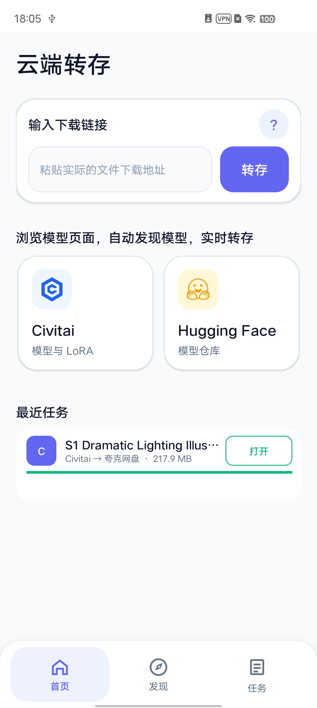
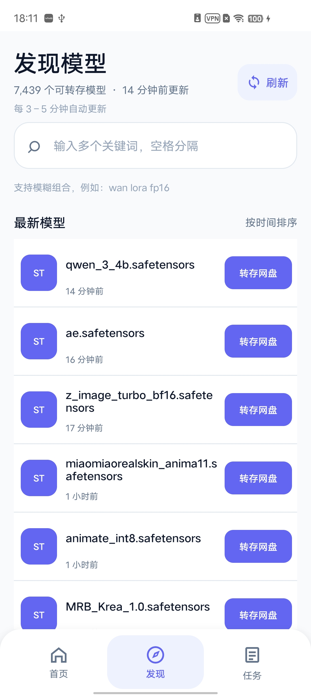
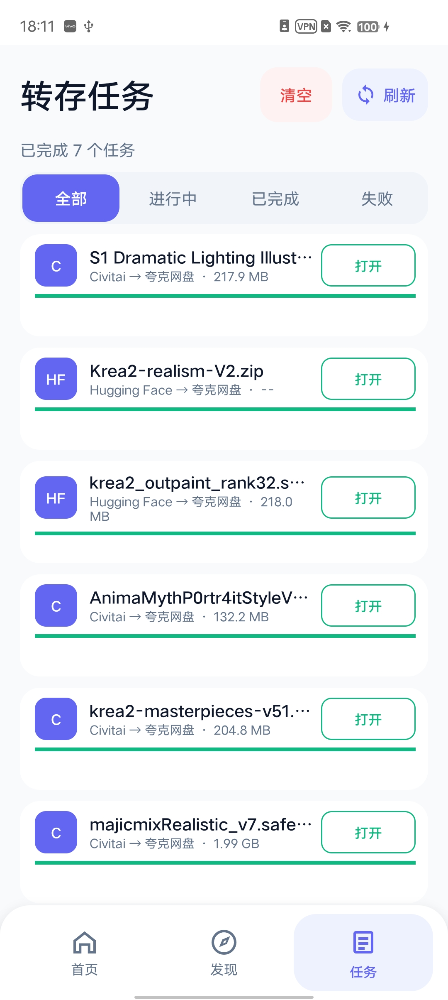

# 云端转存 Android

一款用于转存模型文件的 Android 应用，支持 Civitai、Hugging Face 和文件下载直链。

- 支持 Android 8.0 及以上系统
- 支持 64 位 ARM Android 手机和平板

## 下载应用

- [下载最新版 APK](https://github.com/xuhongming251/CloudFileRelayAndroid/releases/latest/download/CloudFileRelayAndroid.apk)
- [查看全部版本](https://github.com/xuhongming251/CloudFileRelayAndroid/releases)

## 应用预览

[▶ 观看操作演示视频](docs/media/app-demo.mp4)

<p align="center">
  
  
  
</p>

## 一、软件功能简介

- 输入文件下载地址，直接创建转存任务。
- 在应用内浏览并登录 Civitai、Hugging Face。
- 打开模型页面后，自动发现可转存文件。
- 支持单选、多选模型文件。
- Hugging Face 支持将整个仓库打包为 ZIP。
- 发现页面支持多关键词模糊搜索。
- 任务页面可查看进度、打开网盘链接和删除记录。
- 当前支持夸克网盘转存，百度网盘和移动云盘暂不可选。

## 二、使用说明

### 安装应用

1. 将 APK 文件发送到 Android 手机。
2. 在文件管理器中点击 APK。
3. 按照系统提示完成安装。

### 使用下载地址转存

1. 在首页输入真实的文件下载地址。
2. 点击“转存”。
3. 确认文件名并选择目标网盘。
4. 点击“开始转存”。
5. 在“任务”页面查看进度。

### 浏览模型网站并转存

1. 在首页点击 Civitai 或 Hugging Face。
2. 如有需要，先登录自己的账号。
3. 打开需要下载的模型页面。
4. 选择一个或多个文件。
5. 点击“立即转存”，选择网盘后提交。

Hugging Face 可选择“打包全部文件”，将整个仓库打包为 ZIP。

### 发现模型

1. 点击底部“发现”。
2. 浏览模型，或在搜索框中输入关键词。
3. 多个关键词使用空格分开，例如 `wan lora fp16`。
4. 点击模型右侧按钮即可转存。

### 管理任务

- 使用顶部标签筛选任务状态。
- 点击任务可查看完整文件名。
- 转存完成后，可直接打开网盘链接。
- 左滑可删除单条记录，也可以清空任务列表。

## 三、下载源码和构建应用

### 准备工具

- Android Studio
- Java 17
- Android SDK 35

缺少 Java 或 Android SDK 时，可按照 Android Studio 的提示安装。

### 下载源码

项目地址：<https://github.com/xuhongming251/CloudFileRelayAndroid>

新手可以直接[下载源码 ZIP](https://github.com/xuhongming251/CloudFileRelayAndroid/archive/refs/heads/main.zip)，下载完成后解压。

也可以在项目页面点击：

```text
Code → Download ZIP
```

已安装 Git 的用户也可以执行：

```bash
git clone https://github.com/xuhongming251/CloudFileRelayAndroid.git
cd CloudFileRelayAndroid
```

### 构建 Debug APK

1. 打开 Android Studio。
2. 选择包含 `settings.gradle` 的项目文件夹。
3. 等待项目同步完成。
4. 点击 `Build → Build Bundle(s) / APK(s) → Build APK(s)`。

生成的 APK 位于：

```text
app/build/outputs/apk/debug/app-debug.apk
```

也可以在项目目录执行：

```bash
./gradlew assembleDebug
```

Windows 请执行：

```bat
gradlew.bat assembleDebug
```

### 构建 Release APK

在 Android Studio 中点击：

```text
Build → Generate Signed Bundle / APK → APK
```

按照提示选择或创建签名文件，再选择 `release` 完成构建。

请妥善保存签名文件和密码，以后更新应用时需要继续使用同一份签名。
